# 07/05 07/08
程笑天 Mike Cheng
## Literature/Code Links
There is a detailed and fully sorted-out repo here:
https://github.com/xinghaochen/awesome-hand-pose-estimation

Paper | Conference| Institution | Project | Descriptions |Evaluated Datasets| Relative Performance 
----- | ----- | ----- | ----- | -----| ----- | -----
[Detect-and-Track: Efficient Pose Estimation in Videos](http://openaccess.thecvf.com/content_cvpr_2018/papers/Girdhar_Detect-and-Track_Efficient_Pose_CVPR_2018_paper.pdf) | CVPR2018  | CMU |  [DetectAndTrack](https://github.com/facebookresearch/DetectAndTrack/)| 2-staged pipline: (1) 3D vesion of Mask-RCNN (input: video clips; output: bbox for cls/reg head and keypoint head); (2) Viewing the bbox in frames as a graph, using hungarian or greedy algorithm to connect all bbox of different frames, i.e. tracking.  <b>A</b>: Leveraging temporal info; fast  <b>D</b>: only on multi-body detect | PoseTrack: multi-person video | Total MOTA(Multi-Object Tracking Accuracy): 49.6% compared to 46.1%( [Joint multi-person pose estimation and tracking](http://openaccess.thecvf.com/content_cvpr_2017/papers/Song_Thin-Slicing_Network_A_CVPR_2017_paper.pdf))
[GANerated Hands for Real-Time 3D Hand Tracking from Monocular RGB](http://openaccess.thecvf.com/content_cvpr_2018/papers/Mueller_GANerated_Hands_for_CVPR_2018_paper.pdf)|CVPR2018|MPI|N/A | 3-staged pipeline for augmentation, 2D heatmaps and 3D relative locations prediction, and global coordinates acquisition through a minimization of an energy function. | (1) Training data: Self-made webcam images($640\times480$) [SynthHands Dataset](https://handtracker.mpi-inf.mpg.de/projects/OccludedHands/SynthHands.htm) with self-made rendering synthetic image. (2) Testing: Stereo (SHB), [Dexter+Object](https://handtracker.mpi-inf.mpg.de/projects/RealtimeHO/dexter+object.htm), [EgoDexter](https://handtracker.mpi-inf.mpg.de/projects/OccludedHands/EgoDexter.htm) | Criteron: Percentage of Correct Keypoints(PCK): a candidate keypoint is correct as long as it is within a certain radius to the gt: AUC=0.965 on Stereo compared to 0.709(PSR), 0.748(ICPPSO),0.839(CHPR),0.948(Zimmerman and Brox(Z&B)); AUC=0.64 on D+O outperforming 0.49(Z&B),AUC=0.54 outperforming 0.44(Z&B)  [Z&B: Learning to Estimate 3D Hand Pose from Single RGB Images](https://arxiv.org/pdf/1705.01389.pdf)  [PSO,ICPPSO,CHPR:Learning to Estimate 3D Hand Pose from Single RGB Images](http://openaccess.thecvf.com/content_ICCV_2017/papers/Zimmermann_Learning_to_Estimate_ICCV_2017_paper.pdf)
[Cross-modal Deep Variational Hand Pose Estimation](http://openaccess.thecvf.com/content_cvpr_2018/papers/Spurr_Cross-Modal_Deep_Variational_CVPR_2018_paper.pdf)|CVPR2018|ETH|[vae-hands-3d](https://github.com/spurra/vae-hands-3d) | using VAE (Variational-AutoEncoder) to project multi-modality hands' dataset into a common latent space; you may feed one modality and get the output of another; modality including 2D hand coordinates, 3D key points and RGB image   <b>A</b>: novel idea, connect various modality to each other  <b>D</b>: (1) Could not locate hands (2) fail to deal with multi-hands scenario | Stereo Hand Pose Tracking Benchmark(STB); Rendered Hand Pose Dataset(RHD) | Metric: the mean squared end-point errors (EPE): All compared to [Learning to Estimate 3D Hand Pose from Single RGB Images](https://arxiv.org/pdf/1705.01389.pdf) noted; RGB --> 3D on RHD: 19.73 mm surpassing 30.42 mm; on STB: 8.56mm surpassing 8.68mm
[Analysis of Hand Segmentation in the Wild](http://openaccess.thecvf.com/content_cvpr_2018/papers/Urooj_Analysis_of_Hand_CVPR_2018_paper.pdf)|CVPR2018|UCF|[Hand-Segmentation-in-the-Wild](https://github.com/aurooj/Hand-Segmentation-in-the-Wild) | 3 staged pipline: (1) Core Part, train a RefineNet to get a coarse handmap (2) Using Conditional Random Field(CRF) to fine-tune the segmentation (3) Train an AlexNet to classify what the hands are doing    <b>A</b>: could be leveraged for classifying the surgeon's activity like pulling, moving, picking ...; could perform segmentation  <b>D</b>: not directly applied to tracking| (1) EgoHands: pixel-level ground truth  (2) EgoYouTubeHands(EYTH): manually anotated  (3) GTEA  (4) HandOverFace(HOF): collected by the researchers |  
[Mask-pose Cascaded CNN for 2D Hand Pose Estimation from Single Color Image](https://www.yangangwang.com/papers/WANG-MCC-2018-10.pdf)|TCSVT2018|THU|[Link](https://www.yangangwang.com/papers/WANG-MCC-2018-10.html) | 2-stage pipeline:  (1) hand mask prediction   (2) hand pose prediction   both are deep CNN network blocks.   <b>A</b>: Could give out the mask in the intermeditary stage  <b>D</b>: Singe Hand Only! | OneHand10K: self-made and annotated single hand dataset MPI+NZSL Dataset Syn2,Syn3 | Metric: AUC on PCK, compared to [Hand Keypoint Detection in Single Images using Multiview Bootstrapping](https://zpascal.net/cvpr2017/Simon_Hand_Keypoint_Detection_CVPR_2017_paper.pdf)  did great on its own dataset but was surpassed by its oponent on MPI+NZSL   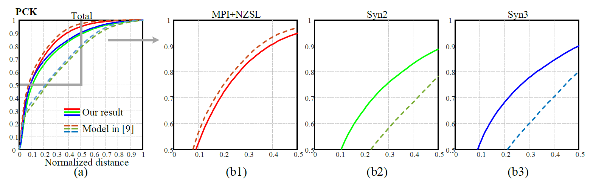
[Hand Pose Estimation via Latent 2.5D Heatmap Regression](http://openaccess.thecvf.com/content_ECCV_2018/papers/Umar_Iqbal_Hand_Pose_Estimation_ECCV_2018_paper.pdf)|ECCV2018|NVIDIA| N/A | 2-staged pipeline: (1) a novel CNN is used to get 2.5D representation of coordinates $(x,y,\hat{z})$, where $\hat{z}$ means a normalized relative depth (2) reconstruct the 3D pose and location from the 2.5D | Dexter+Object(D+O): video recorded by a static camera with single hand and single object; Annotated only on fingertips   EgoDexter(ED): video recorded with a body-mounted camera with complex interactions    Stereo Hand Pose(SHP): 3D pose annotations of 21 keypoints for 6 pairs of stereo sequences   Rendered Hand Pose(SHP): synthetic imgs   MPII+NZSL: 2D annotations for in-the-wild imgs | 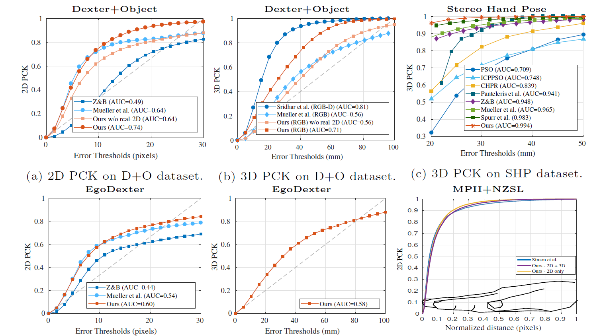  [Z&B: Learning to Estimate 3D Hand Pose from Single RGB Images](https://arxiv.org/pdf/1705.01389.pdf);  [Mueller et al.: GANerated Hands for Real-Time 3D Hand Tracking from Monocular RGB](http://openaccess.thecvf.com/content_cvpr_2018/papers/Mueller_GANerated_Hands_for_CVPR_2018_paper.pdf)
[Using a single RGB frame for real time 3D hand pose estimation in the wild](http://users.ics.forth.gr/~argyros/mypapers/2018_03_WACV_rgbmonohand.pdf) |WACV2018 | FORTH, Greece | [MonocularRGB_3D_Handpose_WACV18](https://github.com/FORTH-ModelBasedTracker/MonocularRGB_3D_Handpose_WACV18) | 3-Staged Pipeline: (1) Detect with Yolo v2 (annotated automatically by OpenPose); (2) Use the network from [Hand Keypoint Detection in Single Images using Multiview Bootstrapping](https://zpascal.net/cvpr2017/Simon_Hand_Keypoint_Detection_CVPR_2017_paper.pdf); (3) 2D-3D conversion   feature: highly recommended, could detect multiple hands | Stereo handpose dataset (SHD); Synthetic Dataset (B2RGB); Hands in action RGB-D dataset (HIC) | Metric: the percentage if franes for which the average 3D joints is below a certain threshold.   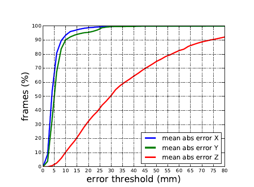
[Domain transfer for 3d pose estimation from color images without manual annotations](https://arxiv.org/pdf/1810.03707.pdf)|ACCV2018|Graz University of Technology, Austria|N/A| Although when validating, the depth maps are not necessary, but they are leveraged in training to help map the RGB to depth space. So still need to get RGB-D dataset.
[Hand Keypoint Detection in Single Images using Multiview Bootstrapping](https://zpascal.net/cvpr2017/Simon_Hand_Keypoint_Detection_CVPR_2017_paper.pdf) | CVPR2017 | CMU| N/A | need to setup multi-view camera 
[Learning to Estimate 3D Hand Pose from Single RGB Images](https://arxiv.org/pdf/1705.01389.pdf)|ICCV2017|University of Freiburg|[hand3d](https://github.com/lmb-freiburg/hand3d)| 3-Staged pipeline;   (1) Hand-Segmentation to localize the hand   (2) PoseNet localize the keypoint in 2D img   (3) 2D-3D inversion; Noted: (1)/(2) are based on the network from [Convolutional pose machines](https://arxiv.org/pdf/1602.00134.pdf?);    Recommended. Only need the first 2 stages.| Stereo Hand Pose Tracking Benchmark: providing 2d&3d annotations.    Dexter: color img, Depth map, annotations for finger tips and cuboid corners    Rendered HandPose Dataset: self-made with localization coordinates and 33 segmentation maps. | Metric: AUC on PCK, 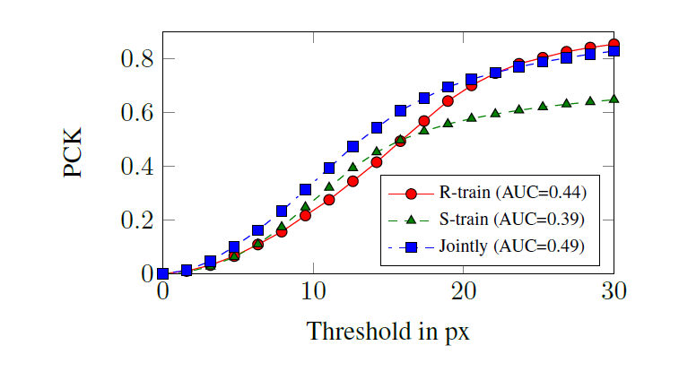
[3D Hand Pose Tracking and Estimation Using Stereo Machine](https://arxiv.org/pdf/1610.07214.pdf)| arXiv2016 | N/A | N/A 
[Detecting hands and recognizing activities in complex egocentric interactions](https://ieeexplore.ieee.org/stamp/stamp.jsp?tp=&arnumber=7410583)| ICCV2015 |Indiana University| [Hand_Detection](https://github.com/anujasaini/Hand_Detection/tree/master/handtracking)|
[Realtime multiperson 2d pose estimation using part affinity fields]() |
[Convolutional pose machines](https://arxiv.org/pdf/1602.00134.pdf?)| CVPR2016 | CMU |  [Convolutional Pose Machines](https://github.com/shihenw/convolutional-pose-machines-release)| 
[OpenPose]()|
[DensePose]()|
[3D Hand Shape and Pose Estimation from a Single RGB Image](http://openaccess.thecvf.com/content_CVPR_2019/papers/Ge_3D_Hand_Shape_and_Pose_Estimation_From_a_Single_RGB_CVPR_2019_paper.pdf)|CVPR2019|NTU|[hand-graph-cnn](https://github.com/3d-hand-shape/hand-graph-cnn) | Using Graph-CNN to generate 3D-meshes of hands. Weakness: will need synthetic datasets with mesh gt. And will need depth map to generate mesh for weakly-supervised learning. <b>Huge setback for surgery-trackers: need to figure out a way to generate the ground truth of the meshes!</b>|

## AnaAnalysis of Hand Segmentation in the Wild
### Results
#### 1

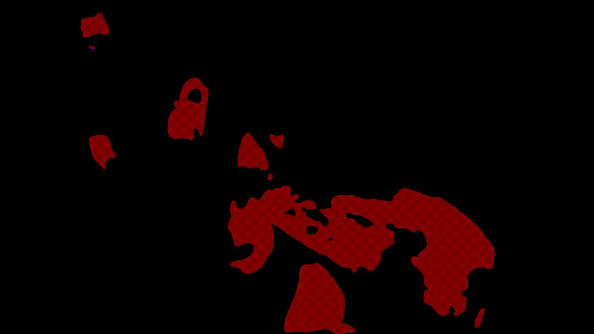
#### 2

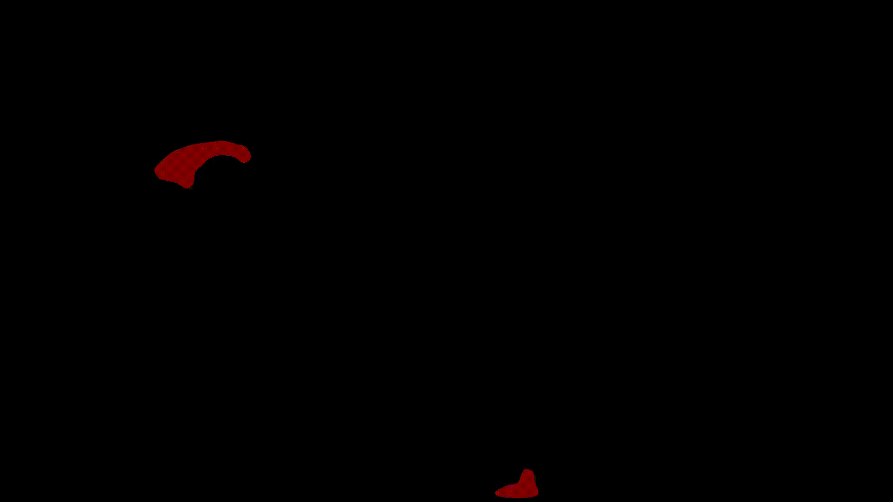
#### 3

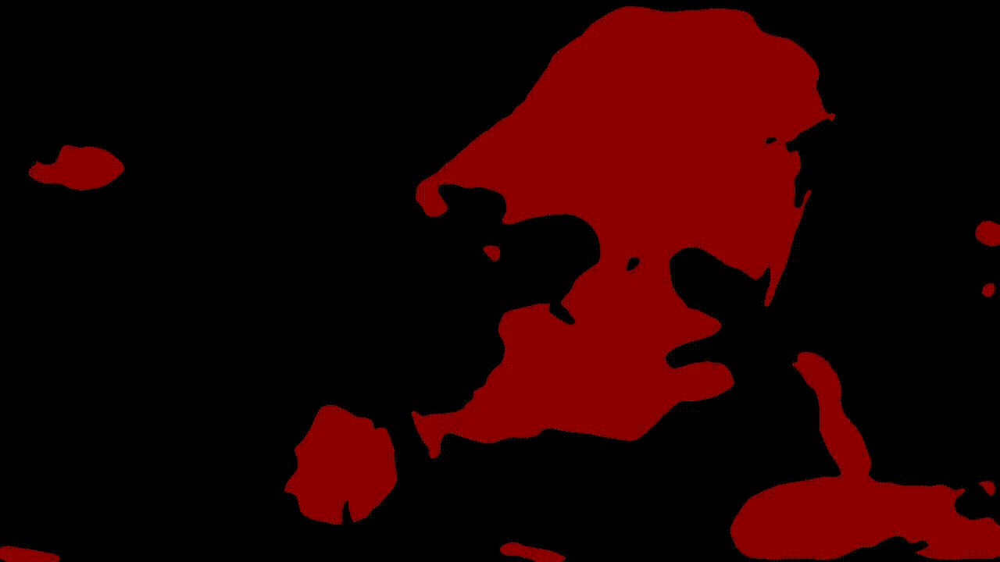
#### 4
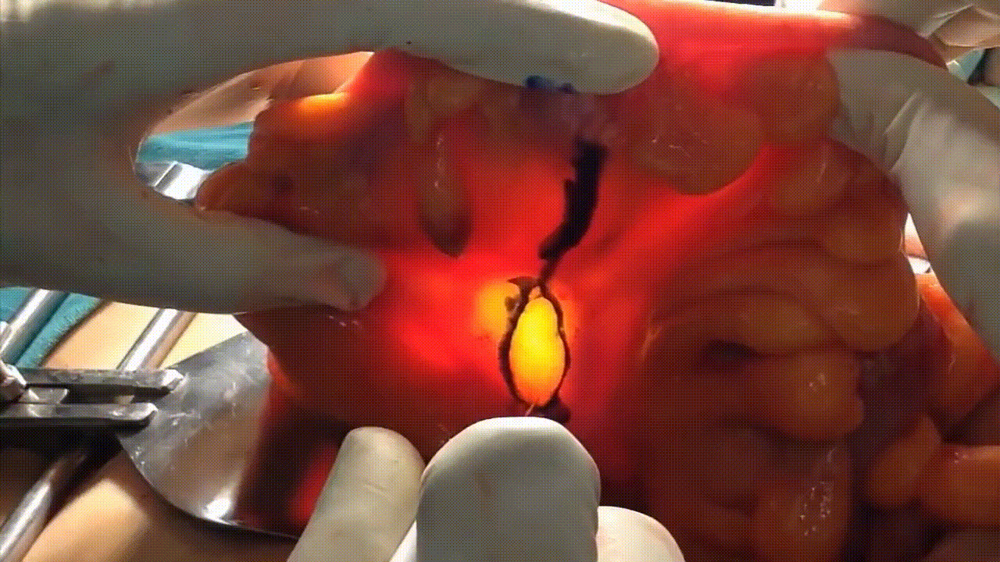
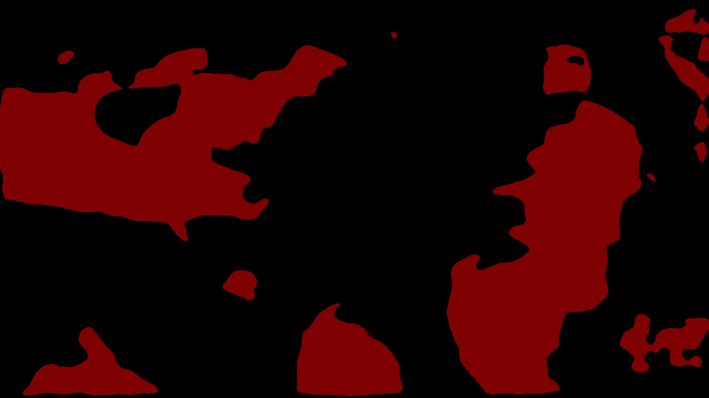
#### 5
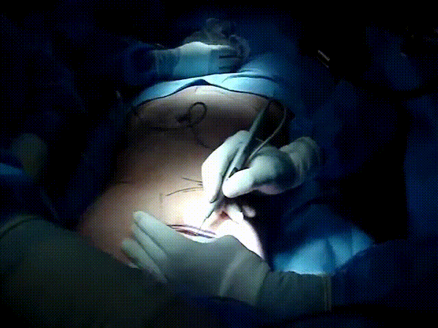
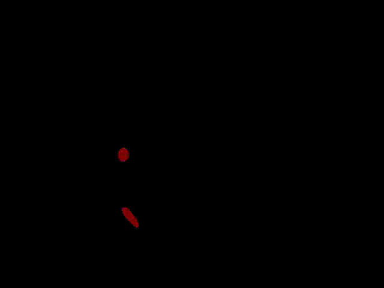

