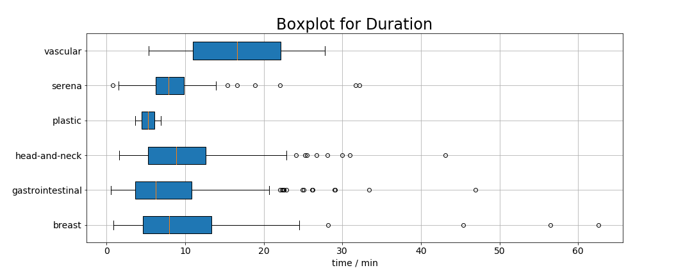
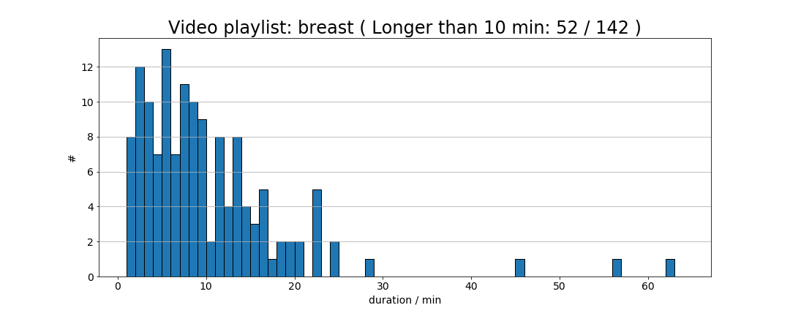
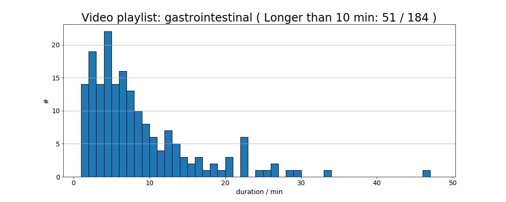
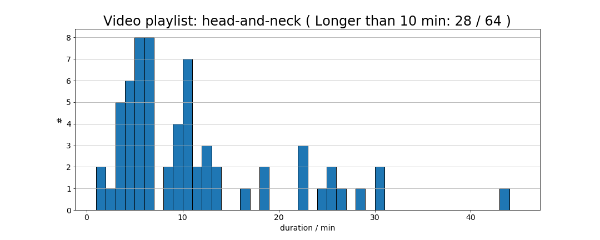
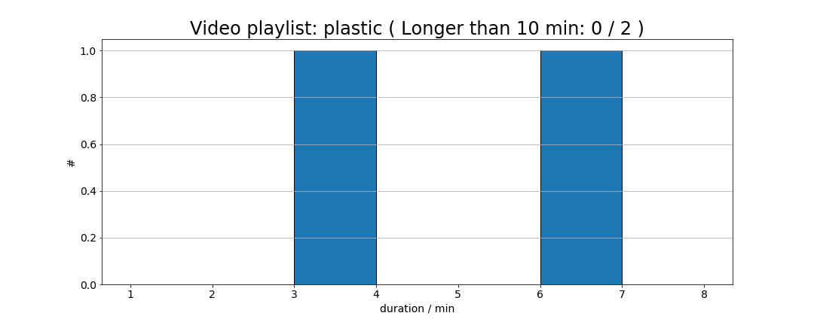
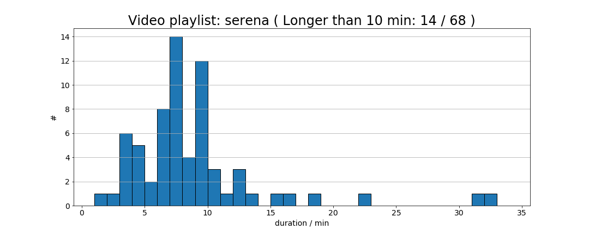
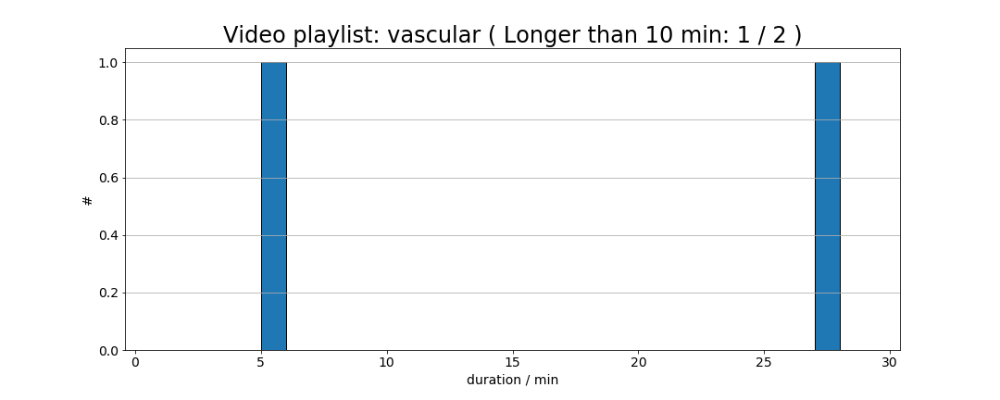

# Distribution
Cheng

## Form
Type | Longer than 10 min | Total
--- | --- | --- 
breast | 52 | 142
gastrointestinal | 51 | 184
head-and-neck | 28 | 64
plastic | 0 | 2
Serena | 14 | 68 
vascular | 1 | 2

## Graph

### Boxplot

### Histogram

